# Playbook de Despliegue Técnico: Servidor OpenLDAP (planetafp.local)

---

## 1. Objetivo

Instalar y configurar un servidor **OpenLDAP** en una máquina virtual con Ubuntu Server, usando una red interna con IP fija, y comprobar que el servicio funciona correctamente.

Al terminar el playbook se habrá conseguido:

- Una red NAT en VirtualBox sin DHCP.
- Un servidor Ubuntu con la IP fija `20.0.0.5`.
- El nombre `ldapserver.planetafp.local` resuelto de forma local.
- El servicio `slapd` instalado, activo y escuchando en el puerto 389.
- El directorio base `dc=planetafp,dc=local` creado y comprobado.

---

## 2. Ficha técnica del entorno

| Parámetro | Valor |
| --- | --- |
| Hipervisor | VirtualBox |
| Nombre de la máquina virtual | Ubuntu server - Playbook |
| Red de VirtualBox | Red NAT llamada `RedLDAP`, rango `20.0.0.0/24`, **DHCP deshabilitado** |
| Adaptador de red | Intel PRO/1000 MT Desktop, conectado a "Red NAT" |
| Sistema operativo | Ubuntu Server (la versión exacta se ve con `lsb_release -a`) |
| Usuario del sistema | `honeynet` |
| Nombre del equipo (hostname) | `ldapserver` |
| Interfaz de red | `enp0s3` |
| Dirección IP | `20.0.0.5/24` (estática, con Netplan) |
| Puerta de enlace | `20.0.0.1` |
| DNS externos | `8.8.8.8` y `1.1.1.1` |
| Nombre completo (FQDN) | `ldapserver.planetafp.local` |
| Dominio del directorio | `planetafp.local` → `dc=planetafp,dc=local` |
| Organización | `planetafp` |
| Administrador de LDAP | `cn=admin,dc=planetafp,dc=local` |
| Versión de OpenLDAP | slapd 2.6.10 (se ve en la captura 13) |
| Paquetes | `slapd`, `ldap-utils` |
| Puerto del servicio | 389/TCP |

---

## 3. Conceptos básicos

**Servicio de directorio:** es una base de datos pensada para **leer y buscar** información rápido. Guarda los datos en forma de árbol (jerarquía), llamado **DIT**. No sirve para operaciones complejas como una base de datos normal.

**LDAP:** (*Lightweight Directory Access Protocol*) es el protocolo que se usa para consultar y modificar un directorio. Funciona sobre TCP/IP, en el puerto 389.

**OpenLDAP:** es el programa libre que implementa LDAP.

**Usos típicos:** autenticación centralizada, gestión de usuarios y grupos, libretas de direcciones.

### Componentes

| Componente | Para qué sirve |
| --- | --- |
| `slapd` | Es el servidor de OpenLDAP. Recibe las peticiones, aplica los esquemas y guarda el directorio. |
| `ldap-utils` | Herramientas de consola para trabajar con LDAP: `ldapsearch`, `ldapadd`, `ldapmodify`, `ldapdelete`, etc. |
| `libldap` y `liblber` | Librerías que usan el servidor y las herramientas para entender el protocolo. |

---

## 4. Procedimiento de despliegue

### Fase 0. Preparar VirtualBox y la máquina virtual

#### Paso 0.1. Crear la red NAT

En VirtualBox: **Herramientas → Redes → Redes NAT → Crear**. Datos de la red:

| Campo | Valor |
| --- | --- |
| Nombre | `RedLDAP` |
| Prefijo IPv4 | `20.0.0.0/24` |
| Habilitar DHCP | **Desmarcado** |
| Habilitar IPv6 | Desmarcado |

**¿Por qué se desactiva el DHCP?** Porque el servidor tendrá una IP fija. Un servidor de directorio siempre debe estar en la misma dirección para que los clientes lo encuentren.

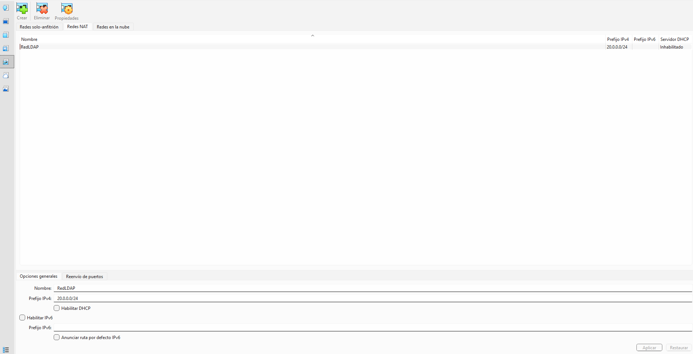

*Captura 1: la red `RedLDAP` aparece con prefijo `20.0.0.0/24` y servidor DHCP "Inhabilitado".*

#### Paso 0.2. Conectar la máquina virtual a la red

En la configuración de la máquina virtual, entrar en **Red → Adaptador 1** y poner:

- Habilitar adaptador de red: **activado**.
- Conectar a: **Red NAT**.
- Nombre: **RedLDAP**.

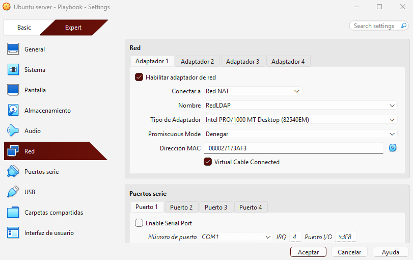

*Captura 2: el Adaptador 1 está conectado a la Red NAT `RedLDAP`.*

#### Paso 0.3. Instalar Ubuntu Server

Durante la instalación se crean el usuario y el nombre del servidor:

| Campo del instalador | Valor |
| --- | --- |
| Su nombre | `honeynet` |
| Nombre del servidor | `ldapserver` |
| Nombre de usuario | `honeynet` |
| Contraseña | *(contraseña elegida)* |

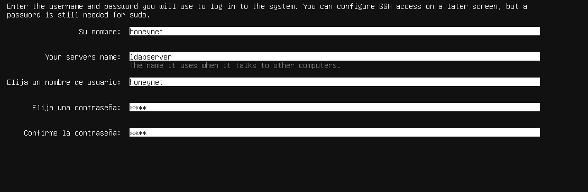

*Captura 3: se ve el usuario `honeynet` y el nombre del servidor `ldapserver`.*

---

### Fase 1. Configurar la red estática con Netplan

#### Paso 1.1. Ver el nombre de la interfaz

```bash
ip -br a
```

- `ip -br a` enseña un resumen (`-br` = *brief*) de las interfaces de red y sus IPs.
- La interfaz de este servidor se llama `enp0s3`. Es la que se usa en el fichero YAML.

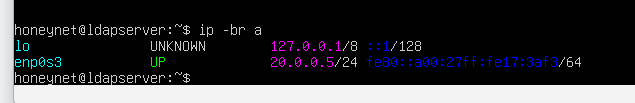

*Captura 4: la interfaz `enp0s3` aparece en estado `UP`.*

#### Paso 1.2. Editar el fichero de Netplan

```bash
sudo nano /etc/netplan/00-installer-config.yaml
```

Contenido del fichero:

```yaml
network:
  version: 2
  ethernets:
    enp0s3:
      dhcp4: false
      addresses:
        - 20.0.0.5/24
      routes:
        - to: default
          via: 20.0.0.1
      nameservers:
        addresses: [8.8.8.8, 1.1.1.1]
```

Qué hace cada parte:

| Línea | Explicación |
| --- | --- |
| `version: 2` | Versión de la sintaxis de Netplan. |
| `enp0s3` | Interfaz que se va a configurar. |
| `dhcp4: false` | Desactiva el DHCP, porque la red no tiene servidor DHCP. |
| `addresses` | IP fija en formato CIDR. `/24` equivale a la máscara `255.255.255.0`. |
| `routes` (`to: default`, `via`) | Puerta de enlace. Sin ella no hay salida a Internet y `apt` falla. |
| `nameservers` | Servidores DNS para poder resolver los nombres de los repositorios. |

> **Importante:** el formato YAML depende de la **indentación**. Se usan espacios, nunca tabuladores.

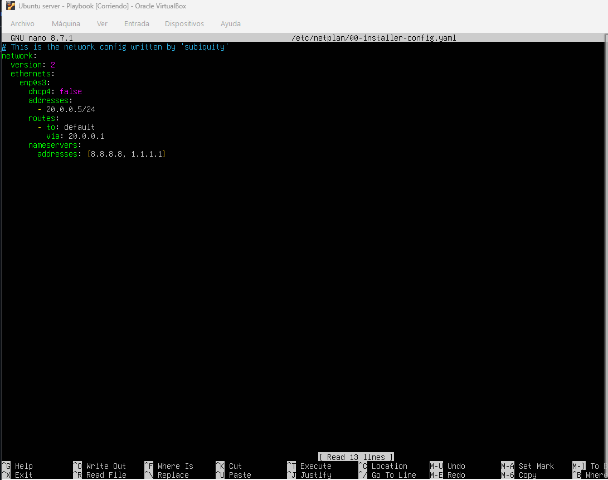

*Captura 5: el fichero `00-installer-config.yaml` con la IP `20.0.0.5/24`, la puerta de enlace `20.0.0.1` y los DNS.*

#### Paso 1.3. Probar y aplicar la configuración

```bash
sudo netplan try
sudo netplan apply
ip -br a
ping -c 3 8.8.8.8
```

- `netplan try`: prueba la configuración y la revierte sola si no se confirma. Así no nos quedamos sin red por un error.
- `netplan apply`: aplica la configuración de forma definitiva.
- `ip -br a`: comprueba que la IP está puesta.
- `ping -c 3 8.8.8.8`: envía 3 paquetes para comprobar que hay salida a Internet.

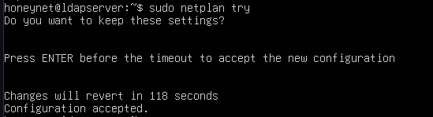

*Captura 6: `netplan try` termina con el mensaje "Configuration accepted".*

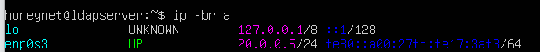

*Captura 7: la interfaz `enp0s3` tiene la IP `20.0.0.5/24`.*

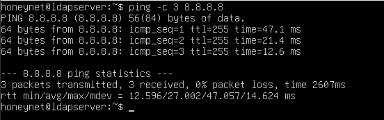

*Captura 8: se envían 3 paquetes y se reciben 3 (0 % de pérdida). Hay conexión a Internet.*

---

### Fase 2. Resolución de nombres local

#### Paso 2.1. Editar el fichero `/etc/hosts`

```bash
sudo nano /etc/hosts
```

Línea añadida:

```text
20.0.0.5   ldapserver.planetafp.local   ldapserver
```

- Formato de la línea: `IP  nombre-completo  alias`.

**¿Por qué se hace?** En la red del laboratorio no hay servidor DNS. Con esta línea, el equipo sabe que `ldapserver.planetafp.local` y `ldapserver` son la IP `20.0.0.5`.

> Esta línea solo funciona en la máquina donde se escribe. Si más adelante se añade un cliente LDAP, ese cliente necesita la misma línea.

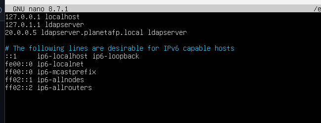

*Captura 9: aparece la línea `20.0.0.5 ldapserver.planetafp.local ldapserver`.*

#### Paso 2.2. Comprobar la resolución

```bash
getent hosts ldapserver.planetafp.local
```

- `getent hosts` pregunta al sistema cómo resuelve un nombre (incluye el fichero `/etc/hosts`).

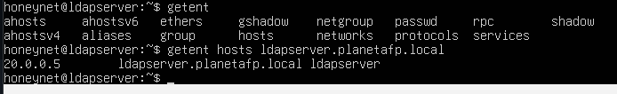

*Captura 10: el nombre `ldapserver.planetafp.local` devuelve la IP `20.0.0.5`.*

---

### Fase 3. Instalación del software

```bash
sudo apt update && sudo apt upgrade -y
sudo apt install slapd ldap-utils -y
```

- `apt update`: actualiza la lista de paquetes disponibles.
- `&&`: ejecuta el siguiente comando solo si el anterior terminó bien.
- `apt upgrade -y`: actualiza los paquetes instalados (`-y` contesta "sí" automáticamente).
- `apt install slapd ldap-utils -y`: instala el servidor LDAP y sus herramientas.

Durante la instalación pide una contraseña de administrador. Se vuelve a configurar en la Fase 4.

---

### Fase 4. Reconfiguración de slapd

```bash
sudo dpkg-reconfigure slapd
```

- `dpkg-reconfigure` vuelve a abrir el asistente de configuración de un paquete ya instalado.
- Es necesario porque la instalación crea un directorio genérico (`nodomain`) que no sirve para nuestra organización.

Respuestas en cada pantalla:

| Pregunta del asistente | Respuesta |
| --- | --- |
| ¿Omitir la configuración del servidor OpenLDAP? | **No** |
| Nombre de dominio DNS | `planetafp.local` (crea la base `dc=planetafp,dc=local`) |
| Nombre de la organización | `planetafp` |
| Contraseña del administrador | *(contraseña elegida)*, y se repite para confirmar |
| ¿Borrar la base de datos al purgar slapd? | **Yes** (si se desinstala con `apt purge`, se borra también la base de datos) |
| ¿Mover la base de datos antigua? | **Yes** (guarda la base `nodomain` como copia de seguridad) |

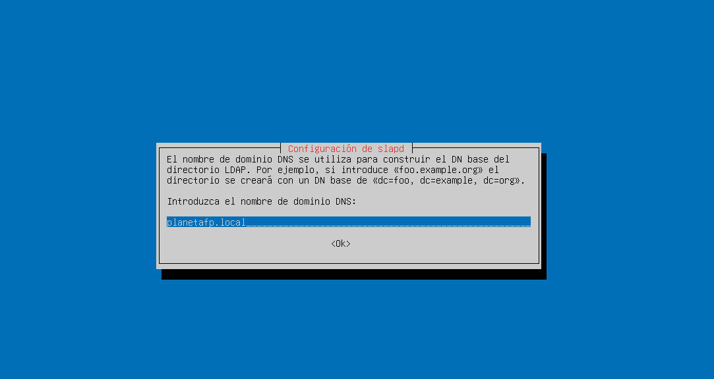

*Captura 11: en el asistente se escribe el dominio `planetafp.local`.*

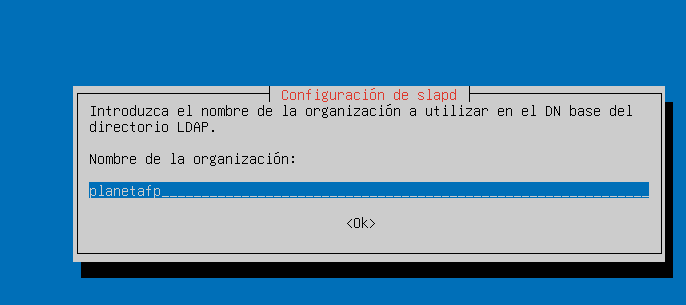

*Captura 12: en el asistente se escribe la organización `planetafp`.*

---

## 5. Verificación

### 5.1. Comprobar que el servicio está activo

```bash
sudo systemctl status slapd
sudo ss -tlnp | grep slapd
```

- `systemctl status slapd`: muestra el estado del servicio. Debe poner `active (running)`.
- `ss -tlnp`: lista los puertos TCP en escucha (`-t` TCP, `-l` escuchando, `-n` números, `-p` proceso).
- `grep slapd`: deja solo las líneas del servicio `slapd`. Debe aparecer el puerto **389**.

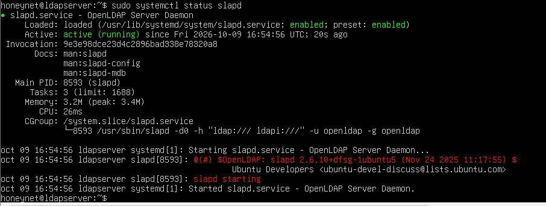

*Captura 13: `slapd.service` aparece como `active (running)` y habilitado (`enabled`). Es la versión 2.6.10.*


*Captura 14: `slapd` escucha en el puerto `389`, tanto en IPv4 (`0.0.0.0:389`) como en IPv6 (`[::]:389`).*

### 5.2. Comprobar los esquemas

```bash
dpkg -L slapd | grep schema
ls /etc/ldap/schema/
sudo ldapsearch -Y EXTERNAL -H ldapi:/// -b "cn=schema,cn=config" dn
```

- `dpkg -L slapd`: lista los ficheros que instala el paquete. `grep schema` deja solo los de esquemas.
- `ls /etc/ldap/schema/`: muestra los ficheros de esquemas. En Ubuntu y Debian la ruta es esta.
- `ldapsearch -Y EXTERNAL -H ldapi:/// ...`: consulta la configuración interna de LDAP como `root`, usando el socket local. Muestra los esquemas cargados.

Los esquemas cargados son:

| Esquema | Para qué sirve |
| --- | --- |
| `core` | Definiciones básicas de LDAP. |
| `cosine` | Atributos y clases de uso común (X.500). |
| `nis` | Datos de usuarios y grupos tipo Unix. |
| `inetorgperson` | Clase `inetOrgPerson`, para personas. |

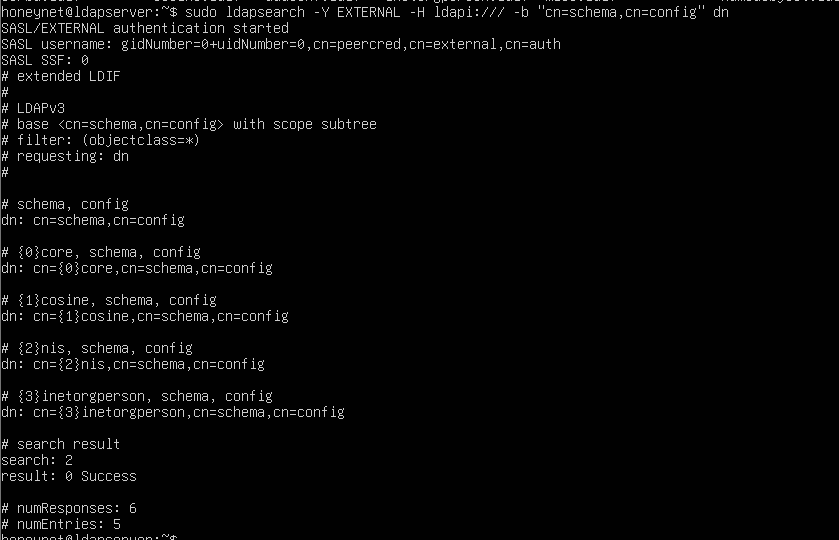

*Captura 15: aparecen los 4 esquemas (`core`, `cosine`, `nis`, `inetorgperson`). El resultado es `0 Success` y `numEntries: 5`.*

### 5.3. Comprobar el directorio base

```bash
ldapsearch -x -H ldap://ldapserver.planetafp.local -b "dc=planetafp,dc=local" -s base
```

- `-x`: autenticación simple (aquí es anónima).
- `-H`: dirección del servidor.
- `-b`: entrada desde donde empieza la búsqueda.
- `-s base`: mira solo esa entrada, sin buscar por debajo.

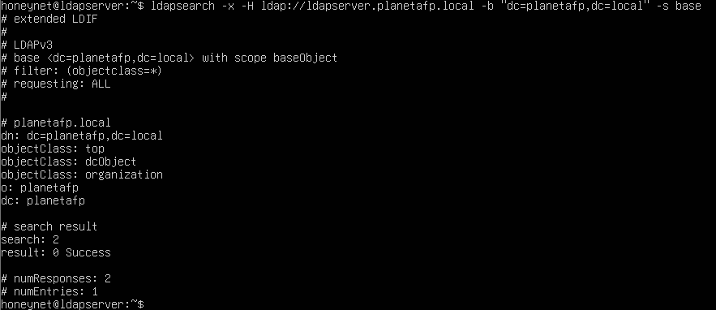

*Captura 16: se obtiene la entrada `dc=planetafp,dc=local` con `o: planetafp`. El resultado es `0 Success` y `numEntries: 1`. Además, el nombre `ldapserver.planetafp.local` funciona.*

---

## 6. Poblar el directorio (operaciones básicas)

### 6.1. Crear el fichero LDIF

El fichero `estructura.ldif` define una unidad organizativa (`ou=alumno`) y un usuario dentro de ella.

```bash
nano estructura.ldif
```

Contenido **correcto**:

```text
dn: ou=alumno,dc=planetafp,dc=local
objectClass: organizationalUnit
ou: alumno

dn: uid=jperez,ou=alumno,dc=planetafp,dc=local
objectClass: inetOrgPerson
cn: Juan Perez
sn: Perez
uid: jperez
mail: jperez@planetafp.local
```

Reglas del formato LDIF:

- Cada entrada empieza con `dn:` (nombre completo de la entrada). Después van los atributos como `atributo: valor`.
- Entre una entrada y otra va **una línea en blanco**.
- El **padre debe existir antes que el hijo**. Por eso la unidad `ou=alumno` va primero.
- La clase `inetOrgPerson` obliga a poner `cn` y `sn`.
- No se usan tildes en los valores. LDIF exige codificarlas en base64 y es un error muy común.

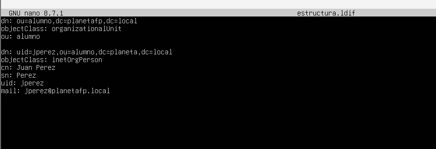

*Captura 17: el fichero `estructura.ldif` en nano.*

### 6.2. Cargar los datos con `ldapadd`

```bash
ldapadd -x -D "cn=admin,dc=planetafp,dc=local" -W -H ldap://localhost -f estructura.ldif
```

- `ldapadd`: añade entradas al directorio.
- `-x`: autenticación simple (usuario y contraseña).
- `-D`: usuario con el que se conecta (el administrador).
- `-W`: pide la contraseña por teclado, para que no quede en el historial.
- `-H ldap://localhost`: servidor al que se conecta.
- `-f`: fichero LDIF que se carga.

Salida esperada:

```text
Enter LDAP Password:
adding new entry "ou=alumno,dc=planetafp,dc=local"

adding new entry "uid=jperez,ou=alumno,dc=planetafp,dc=local"
```

### 6.3. Consultar los datos con `ldapsearch`

```bash
ldapsearch -x -H ldap://localhost -b "ou=alumno,dc=planetafp,dc=local" -s sub "(uid=jperez)" uid cn mail
```

- `-b`: dónde empieza la búsqueda.
- `-s sub`: busca en la base y en todo lo que cuelga de ella. Otras opciones son `base` (solo la base) y `one` (solo los hijos directos).
- `"(uid=jperez)"`: filtro de búsqueda, entre comillas para que la consola no interprete los paréntesis.
- `uid cn mail`: atributos que se quieren ver. Sin ellos se muestran todos.

Salida esperada:

```text
dn: uid=jperez,ou=alumno,dc=planetafp,dc=local
uid: jperez
cn: Juan Perez
mail: jperez@planetafp.local

# numEntries: 1
```

## 7. Control de errores y solución de problemas (Troubleshooting)
 
### 7.1. Errores encontrados
 
#### Error 1. Error de sintaxis en el LDIF
 
- **Mensaje:** `ldap_add: Invalid syntax (21)`, `ldif_read_file: ... line N` o `Object class violation (65)`.
- **Causa:** el fichero `.ldif` está mal escrito. Los motivos más comunes son: falta la línea en blanco entre entradas, hay un espacio al principio de una línea, falta un atributo obligatorio (`cn` o `sn` en `inetOrgPerson`), la clase está mal escrita o hay tildes sin codificar.
- **Cómo comprobarlo:** `cat -A estructura.ldif`. Este comando muestra los espacios y saltos de línea ocultos (el final de cada línea sale marcado con `$`).
- **Solución:** corregir la línea que indica el mensaje. Revisar que cada entrada tenga `dn`, `objectClass` y todos los atributos obligatorios, y que haya una línea en blanco entre entradas.
#### Error 2. La entrada padre no existe
 
- **Mensaje:** `ldap_add: No such object (32)`.
- **Causa:** se intenta crear una entrada cuyo padre no existe. Hay dos casos típicos: poner el usuario antes que su unidad organizativa, o escribir mal el dominio en el `dn`.
- **Por ejemplo nso ha pasado de poner `dc=planeta,dc=local` en vez de `dc=planetafp,dc=local`. Ese padre no existe, así que `ldapadd` daría este error.
- **Cómo comprobarlo:** comparar el `dn` con el dominio real (`dc=planetafp,dc=local`) y mirar el orden de las entradas.
- **Solución:** corregir el dominio y dejar siempre la unidad (`ou=alumno`) antes que el usuario (`uid=jperez,ou=alumno,...`).
#### Error 3. La entrada ya existe
 
- **Mensaje:** `ldap_add: Already exists (68)`.
- **Causa:** se ejecutó `ldapadd` dos veces con el mismo fichero, o ya existe una entrada con ese `dn`.
- **Cómo comprobarlo:** `ldapsearch -x -H ldap://localhost -b "dc=planetafp,dc=local" "(uid=jperez)"`.
- **Solución:** usar otro `dn`, o borrar la entrada con `ldapdelete`, o cambiarla con `ldapmodify`.
#### Error 4. Contraseña o usuario de administrador incorrectos (bind)
 
- **Mensaje:** `ldap_bind: Invalid credentials (49)`.
- **Causa:** la contraseña está mal, o el `dn` del administrador está mal escrito en `-D` (por ejemplo `dc=planeta` en vez de `dc=planetafp`).
- **Cómo comprobarlo:** `ldapwhoami -x -D "cn=admin,dc=planetafp,dc=local" -W -H ldap://localhost`. Si la contraseña es correcta, devuelve el `dn` del administrador.
- **Solución:** revisar el valor de `-D` y escribir bien la contraseña. Si se olvidó, se puede ejecutar `sudo dpkg-reconfigure slapd` para poner una nueva, pero esto **recrea la base de datos y se pierden los datos**.

#### Error 5. Netplan da errores de YAML
 
- **Mensaje:** errores al ejecutar `netplan try` o `netplan apply`, con un número de línea.
- **Causa:** indentación incorrecta, uso de tabuladores o un guion mal puesto.
- **Cómo comprobarlo:** `sudo netplan generate`. Este comando valida el fichero y dice qué línea falla.
- **Solución:** usar solo espacios y comparar con el bloque YAML de la Fase 1. Se recomienda usar siempre `netplan try`: si la red se rompe, vuelve sola a la configuración anterior a los 120 segundos.
---

