# Configuración de un DNS Master/Slave con BIND9 en Debian

Esta guía explica, paso a paso, cómo montar dos servidores DNS que trabajan juntos: uno **Maestro (Master)**, que tiene la configuración original, y uno **Esclavo (Slave)**, que copia automáticamente esa configuración del Maestro. Así, si el Maestro falla, el Esclavo puede seguir respondiendo a las consultas DNS.

## Esquema de red

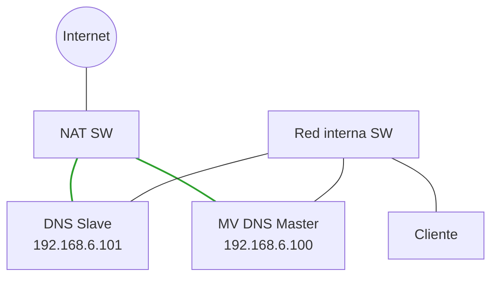

- Las líneas **verdes** representan el **Adaptador 1 (NAT)**: es lo que da acceso a Internet tanto al Maestro como al Esclavo.
- Las líneas **negras** representan el **Adaptador 2 (Red interna)**: es la red privada por la que el cliente consulta al servidor DNS Maestro.

## Índice

1. [Clonación y preparación de las máquinas virtuales](#1-clonación-y-preparación-de-las-máquinas-virtuales)
2. [Configuración de red estática](#2-configuración-de-red-estática)
3. [Instalación de BIND9](#3-instalación-de-bind9)
4. [Configuración del servidor Maestro](#4-configuración-del-servidor-maestro)
5. [Configuración del servidor Esclavo](#5-configuración-del-servidor-esclavo)
6. [Comprobación y verificación final](#6-comprobación-y-verificación-final)

---

## 1. Clonación y preparación de las máquinas virtuales

### 1.1 Clonar la VM en VirtualBox

Para tener dos servidores, lo más rápido es clonar la máquina virtual que ya tenemos en vez de instalar Debian desde cero otra vez:

1. Apaga la máquina virtual principal (`debian`).
2. Haz clic derecho sobre ella y elige **Clonar**.
3. Ponle de nombre a la copia `debian-slave`.
4. En la opción **Política de dirección MAC**, elige **Reiniciar la dirección MAC de todas las tarjetas de red**. Esto es importante: si las dos máquinas tuvieran la misma dirección MAC, podría haber conflictos en la red.

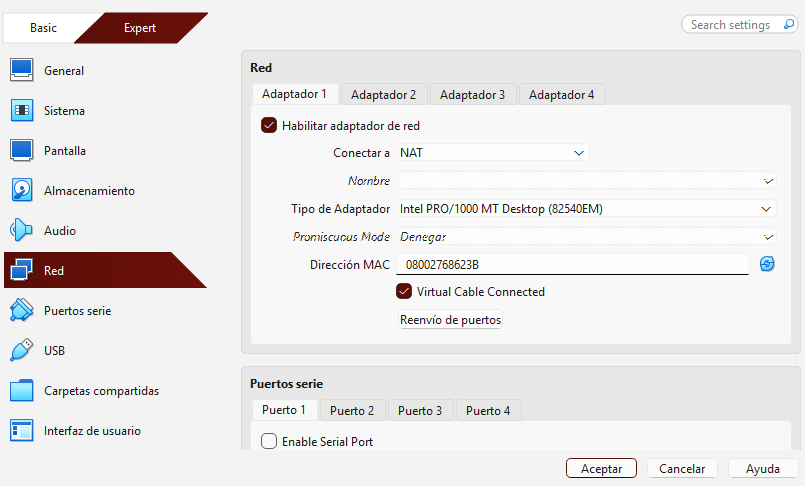

### 1.2 Configurar los adaptadores de red

En **las dos** máquinas virtuales hay que configurar dos adaptadores de red:

- **Adaptador 1:** en modo **NAT**, para que las máquinas tengan salida a Internet.
- **Adaptador 2:** en modo **Red interna** (por ejemplo, con el nombre `intnet`), para que las dos máquinas se puedan comunicar entre ellas.

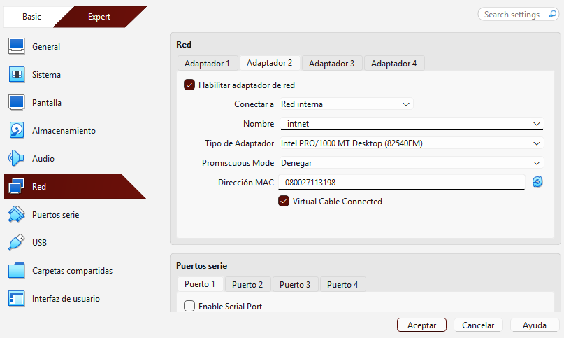

### 1.3 Cambiar el nombre de la VM Esclava

Al encender `debian-slave` por primera vez, todavía tiene el mismo nombre que la máquina original. Hay que cambiarlo para no confundirlas:

```bash
sudo hostnamectl set-hostname debian-slave
```

Después, hay que editar el fichero `/etc/hosts`:

```bash
sudo nano /etc/hosts
```

Y cambiar cualquier referencia al nombre antiguo por `debian-slave`.

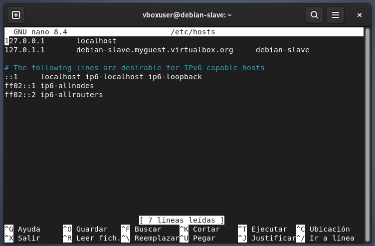

---

## 2. Configuración de red estática

Para que los dos servidores siempre tengan la misma IP (y no les cambie cada vez que arrancan), se les configura una IP fija.

### 2.1 Servidor Maestro (`debian` — 192.168.6.100)

Edita el fichero de red:

```bash
sudo nano /etc/network/interfaces
```

Añade esta configuración para la interfaz `enp0s8` (la de la red interna):

```
allow-hotplug enp0s8
iface enp0s8 inet static
    address 192.168.6.100
    netmask 255.255.255.0
    dns-nameservers 192.168.6.100 1.1.1.1
    dns-search myguest.virtualbox.org
```

Reinicia el servicio de red para que se aplique el cambio:

```bash
sudo systemctl restart networking
```

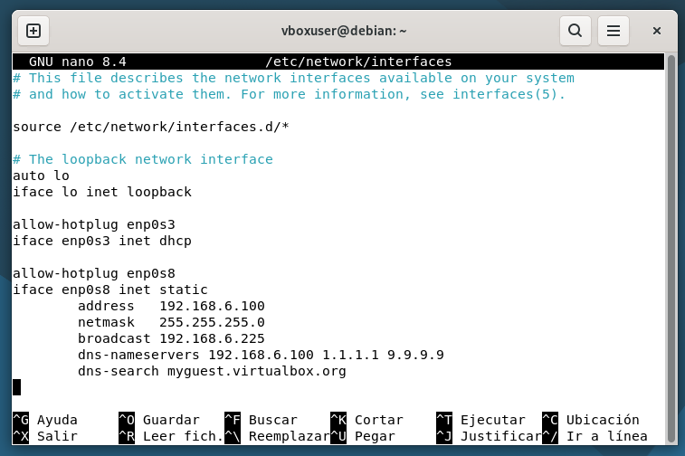

### 2.2 Servidor Esclavo (`debian-slave` — 192.168.6.101)

Edita el mismo fichero, esta vez en el Esclavo:

```bash
sudo nano /etc/network/interfaces
```

Añade la configuración, con una IP distinta a la del Maestro:

```
allow-hotplug enp0s8
iface enp0s8 inet static
    address 192.168.6.101
    netmask 255.255.255.0
    dns-nameservers 192.168.6.100 1.1.1.1 9.9.9.9
    dns-search myguest.virtualbox.org
```

Reinicia la red:

```bash
sudo systemctl restart networking
```

Y comprueba que el Esclavo puede comunicarse con el Maestro:

```bash
ping -c 3 192.168.6.100
```

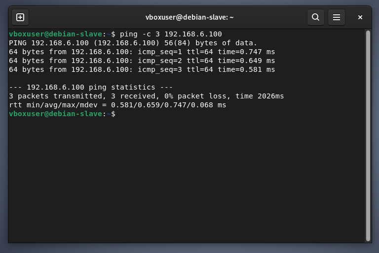

---

## 3. Instalación de BIND9

BIND9 es el programa que convierte a cualquiera de las dos máquinas en un servidor DNS. Se instala igual en **ambas** máquinas:

```bash
sudo apt update
sudo apt install bind9 bind9-utils -y
```

Solo en el Maestro, se crea además una carpeta para guardar los ficheros de las zonas (las zonas son, básicamente, los "listados" de nombres de dominio e IPs que gestiona el DNS):

```bash
sudo mkdir -p /etc/bind/zones
```

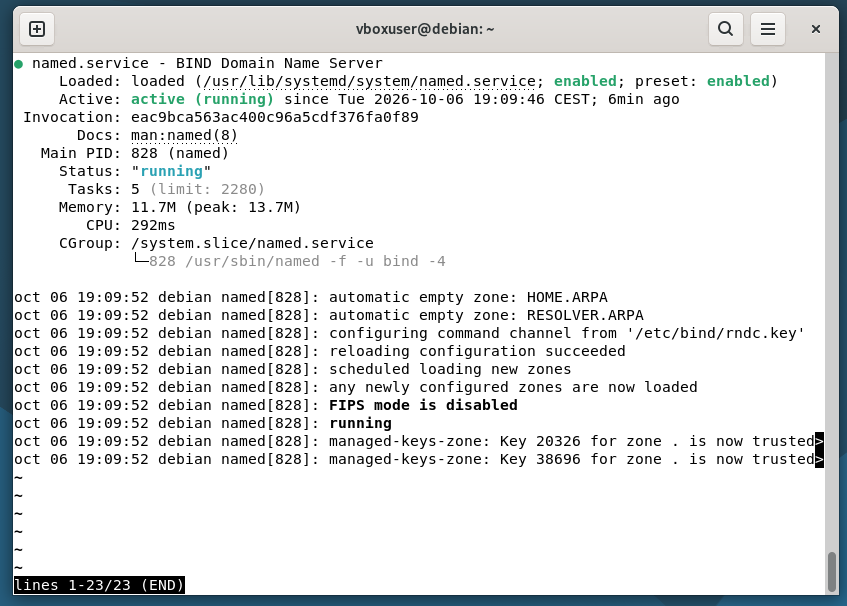

---

## 4. Configuración del servidor Maestro

### 4.1 Zona directa: de nombre a IP

La "zona directa" es la que responde preguntas del tipo *"¿cuál es la IP de este nombre?"*. Se crea el fichero:

```bash
sudo nano /etc/bind/zones/db.myguest.virtualbox.org
```

Con este contenido:

```dns
$TTL    604800
@       IN      SOA     myguest.virtualbox.org. debian.myguest.virtualbox.org. (
                              3         ; Serial
                            12h         ; Refresh
                            15m         ; Retry
                             3w         ; Expire
                             2h )       ; Negative Cache TTL

; Servidores de Nombres (NS)
@       IN      NS      ns.myguest.virtualbox.org.
@       IN      NS      ns2.myguest.virtualbox.org.

; Registros A
ns      IN      A       192.168.6.100
ns2     IN      A       192.168.6.101
debian  IN      A       192.168.6.100
```

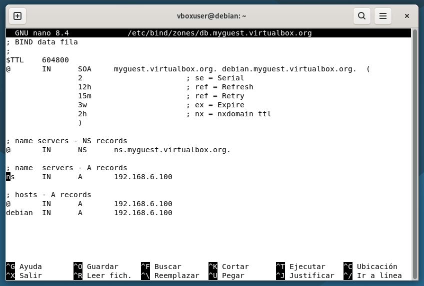

### 4.2 Zona inversa: de IP a nombre

La "zona inversa" hace lo contrario: responde preguntas del tipo *"¿qué nombre tiene esta IP?"*. Se crea el fichero:

```bash
sudo nano /etc/bind/zones/db.6.168.192
```

Con este contenido:

```dns
$TTL    604800
@       IN      SOA     myguest.virtualbox.org. debian.myguest.virtualbox.org. (
                              3         ; Serial
                            12h         ; Refresh
                            15m         ; Retry
                             3w         ; Expire
                             2h )       ; Negative Cache TTL

; Servidores DNS
@       IN      NS      ns.myguest.virtualbox.org.
@       IN      NS      ns2.myguest.virtualbox.org.

; Registros PTR
100     IN      PTR     debian.myguest.virtualbox.org.
101     IN      PTR     ns2.myguest.virtualbox.org.
```

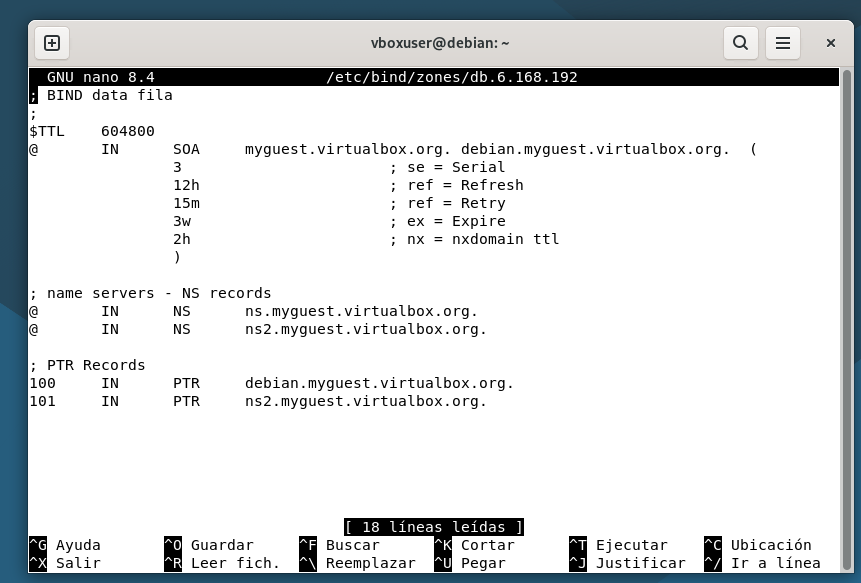

### 4.3 Avisar a BIND9 de que estas zonas existen

Las zonas que acabamos de crear no sirven de nada hasta que BIND9 sepa que existen. Se declaran en:

```bash
sudo nano /etc/bind/named.conf.local
```

Con este contenido. Aquí se indica que el Maestro es `type master` (el dueño original de los datos) y que tiene permiso para enviar copias al Esclavo (`192.168.6.101`):

```dns
// Búsquedas directas
zone "myguest.virtualbox.org" {
    type master;
    file "/etc/bind/zones/db.myguest.virtualbox.org";
    allow-transfer { 192.168.6.101; };
    also-notify { 192.168.6.101; };
};

// Búsquedas inversas
zone "6.168.192.in-addr.arpa" {
    type master;
    file "/etc/bind/zones/db.6.168.192";
    allow-transfer { 192.168.6.101; };
    also-notify { 192.168.6.101; };
};
```

- `allow-transfer` dice qué máquinas tienen permiso para copiar la zona.
- `also-notify` hace que el Maestro avise al Esclavo en cuanto haya un cambio, para que se actualice enseguida.

Antes de reiniciar el servicio, conviene comprobar que no hay errores de sintaxis en los ficheros:

```bash
sudo named-checkconf
sudo named-checkzone myguest.virtualbox.org /etc/bind/zones/db.myguest.virtualbox.org
sudo named-checkzone 6.168.192.in-addr.arpa /etc/bind/zones/db.6.168.192
```

Y por último, se reinicia BIND9 en el Maestro para que cargue la nueva configuración:

```bash
sudo systemctl restart bind9
```

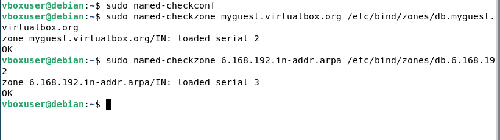

---

## 5. Configuración del servidor Esclavo

### 5.1 Declarar las zonas en el Esclavo

En la máquina `debian-slave`, se edita el mismo tipo de fichero:

```bash
sudo nano /etc/bind/named.conf.local
```

Pero aquí la configuración es distinta: en vez de `type master`, se pone `type slave`, y en vez de guardar la zona en `/etc/bind/zones/`, se guarda en `/var/cache/bind/`, porque es una **copia** que BIND9 descarga automáticamente del Maestro:

```dns
// Búsquedas directas
zone "myguest.virtualbox.org" {
    type slave;
    file "/var/cache/bind/db.myguest.virtualbox.org";
    masters { 192.168.6.100; };
};

// Búsquedas inversas
zone "6.168.192.in-addr.arpa" {
    type slave;
    file "/var/cache/bind/db.6.168.192";
    masters { 192.168.6.100; };
};
```

El apartado `masters` indica de qué servidor tiene que copiar los datos (en este caso, el Maestro: `192.168.6.100`).

Se comprueba la sintaxis y se reinicia el servicio:

```bash
sudo named-checkconf
sudo systemctl restart bind9
```

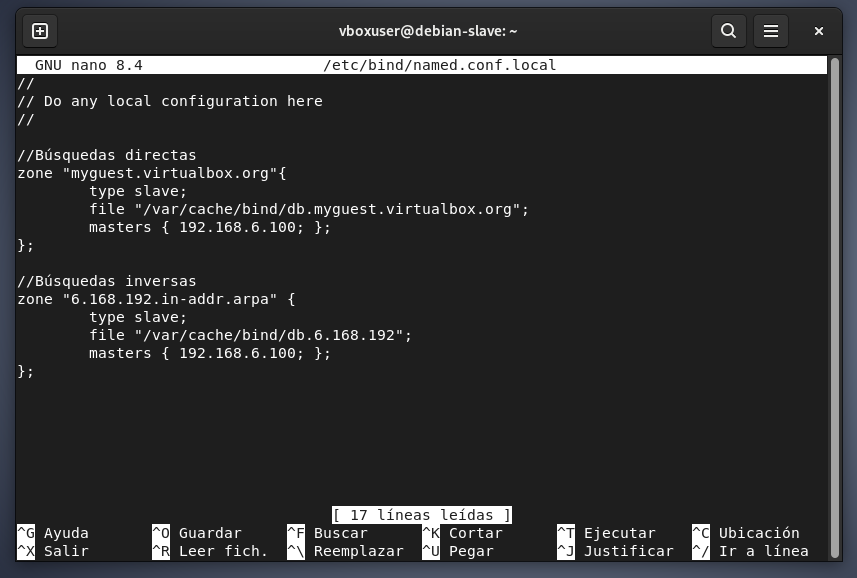

---

## 6. Comprobación y verificación final

### 6.1 Comprobar que la transferencia de zonas funcionó

Si todo ha ido bien, el Esclavo debería haber descargado automáticamente los ficheros de zona del Maestro. Se puede comprobar así:

```bash
ls -l /var/cache/bind/
```

Si aparecen los ficheros `db.myguest.virtualbox.org` y `db.6.168.192`, quiere decir que la transferencia se hizo correctamente.

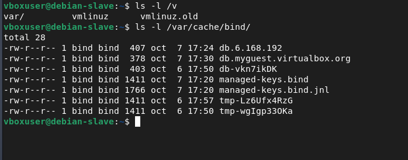

### 6.2 Probar que el Esclavo resuelve nombres correctamente

**Resolución directa** (pedirle una IP a partir de un nombre):

```bash
dig @127.0.0.1 debian.myguest.virtualbox.org
```

Debería devolver `status: NOERROR` y la IP `192.168.6.100` en la sección `ANSWER`.

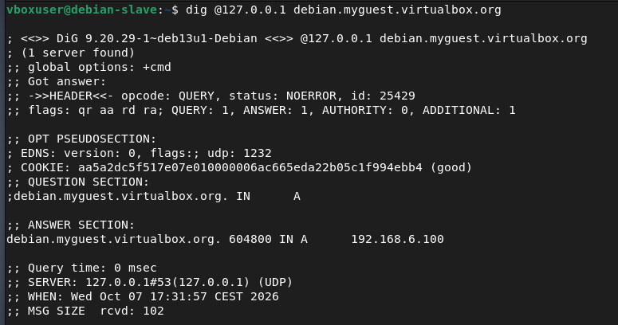

**Resolución inversa** (pedirle un nombre a partir de una IP):

```bash
dig @127.0.0.1 -x 192.168.6.100
```

Debería devolver `status: NOERROR` y el nombre `debian.myguest.virtualbox.org.` en la sección `ANSWER`.

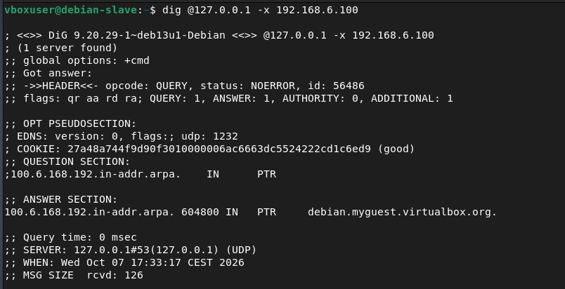

Si las dos pruebas dan resultado correcto, significa que el Esclavo está funcionando igual que el Maestro, y que si el Maestro se cayera, el Esclavo podría seguir respondiendo a las consultas DNS de la red.
